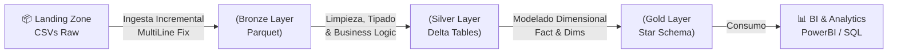

# 🇧🇷 Modern ELT Lakehouse - Brazilian E-Commerce (Olist)

Este proyecto implementa un pipeline de Ingeniería de Datos End-to-End de nivel Enterprise utilizando la arquitectura Lakehouse en Databricks.

El objetivo es transformar datos crudos de e-commerce (Dataset Olist de Kaggle) en un Modelo Dimensional (Star Schema) optimizado para analítica de negocio, aplicando mejores prácticas como SCD Type 1, Optimización Z-Order, Manejo de Esquemas y Calidad de Datos.

## 🏗️ Arquitectura del Pipeline (Medallion)

El flujo de datos sigue la arquitectura Multi-hop (Bronze → Silver → Gold):



## 📂 Estructura del Proyecto

```
/ModernELT-Brazilian-Ecommerce
├── 00_init.py                    # Inicialización de directorios (Landing, Bronze, Silver, Gold)
├── 01_download_landing.py        # Descarga automática de Kaggle -> Landing Zone
├── 02_process_bronze.py          # Ingesta Raw -> Parquet (Manejo de CSVs complejos + Manifest)
├── 03_silver_business_cases.py   # Transformación, Limpieza y Lógica de Negocio (SCD Type 1)
├── 04_Process_Gold_Layer.py      # Modelado Dimensional (Star Schema) y Optimización Z-Order
└── utils.py                      # Configuración de entidades y utilitarios compartidos
```

## 🚀 Características Técnicas (Key Features)

### 1. Ingesta Robusta (Bronze)

**Desafío:** El dataset de reviews contenía saltos de línea (`\n`) dentro de los comentarios, lo que rompía la estructura del CSV y generaba "Column Shifts".

**Solución:** Implementación de lectura con `multiLine=True` y normalización de nombres de columnas.

**Formato:** Parquet (compresión Snappy).

### 2. Lógica de Negocio & Calidad (Silver)

- **Framework de Upsert:** Función genérica para aplicar MERGE (SCD Tipo 1) en Delta Lake, garantizando idempotencia.
- **Defensive Coding:** Uso de `try_cast` para manejar datos sucios sin detener el pipeline (Null Safety).
- **Enriquecimiento:**
  - Cálculo de `lead_time_days` (Tiempo de entrega).
  - Flags analíticos: `is_on_time_delivery`, `is_high_ticket`, `sentiment`.
  - Deduplicación de geolocalización (Centroides por Zip Code).

### 3. Modelado Analítico Avanzado (Gold)

**Esquema de Estrella:** Transformación de 8 tablas relacionales a un modelo optimizado para BI.

- **Facts:** `fact_sales` (Transaccional), `fact_logistics` (Snapshot de estado).
- **Dims:** `dim_customer`, `dim_product`, `dim_seller`, `dim_date`.

**Performance Tuning:**
- **Particionamiento:** Por `date_key` para poda de archivos (Pruning).
- **Z-Ordering:** Co-localización física de datos (`product_id`, `customer_id`) para Data Skipping masivo.
- **Vacuum:** Limpieza de versiones antiguas para optimización de almacenamiento.

## 🗄️ Esquemas de Datos (Databases)

| Schema | Propósito | Tablas |
|--------|-----------|--------|
| `olist_meta` | Metadatos y control de pipeline | `bronze_manifest` |
| `olist_silver` | Datos limpios y normalizados | `orders`, `order_items`, `products`, `customers`, `sellers`, `geolocation`, `order_reviews`, `order_payments` |
| `olist_gold` | Modelo dimensional analítico | `fact_sales`, `fact_logistics`, `dim_customer`, `dim_product`, `dim_seller`, `dim_date` |

## 📊 Modelo de Datos (Gold Layer)

El diseño final permite responder preguntas complejas de negocio mediante SQL simple.

| Tabla | Tipo | Descripción | Granularidad |
|-------|------|-------------|--------------|
| `fact_sales` | Fact | Ventas, ingresos y fletes. | Item de Orden |
| `fact_logistics` | Fact | Tiempos de entrega, retrasos y SLA. | Orden |
| `dim_customer` | Dim | Datos demográficos y ubicación (Geo). | Cliente |
| `dim_product` | Dim | Categoría, volumen (cm3) y peso. | Producto |
| `dim_date` | Dim | Calendario fiscal y atributos temporales. | Día |

## 📈 Insights de Negocio (Ejemplos SQL)

Una vez ejecutado el pipeline, podemos responder preguntas clave:

### 1. Ingresos Mensuales

```sql
SELECT d.year, d.month, FORMAT_NUMBER(SUM(f.total_amount), 2) as revenue
FROM olist_gold.fact_sales f
JOIN olist_gold.dim_date d ON f.date_key = d.date_key
GROUP BY 1, 2 ORDER BY 1 DESC, 2 DESC;
```

### 2. Análisis de Retrasos (SLA)

```sql
SELECT 
    delivery_status_detail,
    speed_class,
    COUNT(order_id) as order_count,
    ROUND(AVG(CASE WHEN delay_days > 0 THEN delay_days ELSE NULL END), 1) as avg_delay_days
FROM olist_gold.fact_logistics
WHERE date_key >= '2017-01-01'
GROUP BY 1, 2
ORDER BY 3 DESC;
```

### 3. Top 10 Categorías por GMV

```sql
SELECT 
    p.category,
    SUM(f.sales_amount) as gmv,
    ROUND(AVG(f.sales_amount), 2) as avg_ticket
FROM olist_gold.fact_sales f
JOIN olist_gold.dim_product p ON f.product_key = p.product_key
GROUP BY 1
ORDER BY 2 DESC
LIMIT 10;
```

### 4. Revenue por Estado

```sql
SELECT 
    c.customer_state,
    COUNT(DISTINCT f.order_id) as num_orders,
    FORMAT_NUMBER(SUM(f.total_amount), 2) as total_revenue
FROM olist_gold.fact_sales f
JOIN olist_gold.dim_customer c ON f.customer_key = c.customer_key
GROUP BY 1
ORDER BY 3 DESC;
```

### 5. Compras Premium en Fin de Semana

```sql
SELECT 
    o.order_id,
    c.customer_city,
    f.total_amount,
    d.day_name
FROM olist_gold.fact_sales f
JOIN olist_gold.dim_date d ON f.date_key = d.date_key
JOIN olist_gold.dim_customer c ON f.customer_key = c.customer_key
JOIN olist_silver.orders o ON f.order_id = o.order_id
WHERE 
    f.is_high_ticket = true 
    AND d.is_weekend = true
ORDER BY f.total_amount DESC
LIMIT 20;
```

## 🛠️ Cómo Ejecutar este Proyecto

### Requisitos

- Cuenta de Databricks (Community/Free Edition sirve).
- Cluster con Spark 3.4+ y Delta Lake.
- Credenciales de Kaggle (API Token `kaggle.json`).
- Unity Catalog configurado con Volumes.

### Pasos

#### 1. **Configuración Inicial**
   
Ejecuta `00_init.py` para crear la estructura de directorios:
```python
# Parámetro: path base del proyecto
# Crea: /landing, /bronze, /silver, /gold, /_checkpoints, /_meta
```

#### 2. **Descarga Automática de Datos (Landing Zone)**
   
Ejecuta `01_download_landing.py`:
```python
# Parámetros:
# - run_date: fecha de ejecución (default: hoy)
# - force_download: true/false (re-descarga si ya existe)

# Descarga dataset de Kaggle usando API
# Output: /Volumes/workspace/default/data/olist/landing/YYYY-MM-DD/
```

**Características**:
- Integración con Kaggle API (autenticación vía `kaggle.json`).
- Control de duplicados: no re-descarga si ya existe (configurable).
- Organización por fecha de ejecución.

#### 3. **Procesamiento Bronze (Ingesta Incremental)**
   
Ejecuta `02_process_bronze.py`:
```python
# Lee CSVs desde Landing Zone
# Aplica multiLine=True para manejar saltos de línea en reviews
# Escribe en formato Parquet particionado por run_date
```

**Características Avanzadas**:
- **Manifest Tracking**: Tabla Delta `olist_meta.bronze_manifest` registra archivos procesados (nombre, size, timestamp).
- **Procesamiento Incremental**: Solo procesa archivos nuevos usando `LEFT ANTI JOIN` contra el manifest.
- **Idempotencia**: Re-ejecutar con mismos datos no genera duplicados.
- **Normalización**: Columnas en lowercase y sin espacios.

#### 4. **Transformación Silver (Business Logic)**
   
Ejecuta `03_silver_business_cases.py`:

**Transformaciones Implementadas**:

| Entidad | Lógica de Negocio | Ejemplo |
|---------|-------------------|---------|
| **orders** | Cálculo de `lead_time_days`, `delay_days`, flags de on-time delivery | `is_on_time_delivery = delivered_ts <= estimated_ts` |
| **products** | Cálculo de volumen (cm³), clasificación por peso | `volume_cm3 = length × height × width` |
| **reviews** | Categorización de sentimiento basada en score | `sentiment = CASE score >= 4 THEN 'Positive'` |
| **geolocation** | Deduplicación por zip code usando centroides | `groupBy(zip).agg(first(lat), first(lng))` |
| **payments** | Flag de compras a plazos | `is_installment = installments > 1` |

**Framework de Upsert**:
- Función genérica `upsert_to_silver()` para aplicar MERGE (SCD Type 1).
- Deduplicación automática por Primary Keys.
- Manejo de errores con `try_cast` para datos corruptos.

#### 5. **Modelado Gold (Star Schema)**
   
Ejecuta `04_Process_Gold_Layer.py`:

**Dimensiones Creadas**:
- `dim_date`: Calendario completo 2016-2025 con atributos temporales (weekend, holiday season).
- `dim_customer`: Enriquecida con coordenadas geográficas (join con geolocation).
- `dim_product`: Incluye volumen, peso y clasificación.
- `dim_seller`: Datos demográficos + lat/lng.

**Tablas de Hechos**:
- **`fact_sales`**: Granularidad item-level, particionada por `date_key`.
  - Métricas: `sales_amount`, `freight_amount`, `total_amount`.
  - Flags: `is_high_ticket` (> $500).
  
- **`fact_logistics`**: Granularidad order-level, análisis SLA.
  - Métricas: `lead_time_days`, `delay_days`.
  - Dimensiones derivadas: `delivery_status_detail`, `speed_class`.

**Optimizaciones Aplicadas**:
```python
# Particionamiento para File Pruning
.partitionBy("date_key")

# Z-Ordering (ejecutar post-carga inicial)
OPTIMIZE olist_gold.fact_sales ZORDER BY (product_key, customer_key);
OPTIMIZE olist_gold.fact_logistics ZORDER BY (customer_key);

# Limpieza de versiones antiguas
VACUUM olist_gold.fact_sales RETAIN 168 HOURS;
```

## ⚡ Mejores Prácticas Implementadas

### 1. **Procesamiento Incremental**
- Sistema de **Manifest Tracking** (`olist_meta.bronze_manifest`) que registra archivos procesados.
- Detección automática de nuevos archivos mediante `LEFT ANTI JOIN`.
- Evita reprocesamiento innecesario de datos ya cargados.

### 2. **Idempotencia**
- Framework de **Upsert genérico** usando Delta MERGE.
- Re-ejecutar el pipeline con los mismos datos no genera duplicados.
- SCD Type 1: actualiza registros existentes, inserta nuevos.

### 3. **Defensive Coding**
- Uso de `coalesce` y casting defensivo para manejar datos nulos/corruptos.
- Validación de esquemas con `multiLine=True` para CSVs complejos.
- Normalización automática de nombres de columnas (lowercase, sin espacios).

### 4. **Optimización de Performance**
```python
# Shuffle Partitions optimizado
spark.conf.set("spark.sql.shuffle.partitions", "8")

# Particionamiento físico
.partitionBy("date_key")

# Data Skipping con Z-Order
OPTIMIZE table_name ZORDER BY (high_cardinality_cols);

# Limpieza de versiones antiguas
VACUUM table_name RETAIN 168 HOURS;
```

### 5. **Organización de Datos**
- **Arquitectura Medallion**: Separación clara entre Raw, Curated y Analytics.
- **Unity Catalog**: Uso de Volumes para almacenamiento estructurado.
- **Nombrado Consistente**: Convención de nombres clara (`date_key`, `customer_key`, etc.).

### 6. **Lógica de Negocio Centralizada**
- Transformaciones en Silver para reutilización en Gold.
- Cálculos complejos encapsulados (lead_time, sentiment, volume).
- Flags analíticos pre-calculados para acelerar queries.

## 📦 Entidades del Dataset (9 Tablas)

| Entidad | Descripción | Registros (aprox.) |
|---------|-------------|-------------------|
| `customers` | Clientes únicos | ~99K |
| `orders` | Órdenes de compra | ~99K |
| `order_items` | Items individuales por orden | ~112K |
| `order_payments` | Métodos de pago | ~103K |
| `order_reviews` | Reviews y ratings | ~99K |
| `products` | Catálogo de productos | ~32K |
| `sellers` | Vendedores (marketplace) | ~3K |
| `geolocation` | Coordenadas de zip codes | ~1M |
| `product_category_name_translation` | Traducción PT→EN | ~71 |

## 👤 Autor

**John Kl**  
Data Engineer en formación  
[LinkedIn](https://www.linkedin.com/in/john-luis-alberto-castillo-reupo-aa3125253/) | [GitHub](https://github.com/Johnkl72)

---

*Este proyecto fue diseñado siguiendo principios de Clean Code y Arquitectura Escalable.*
